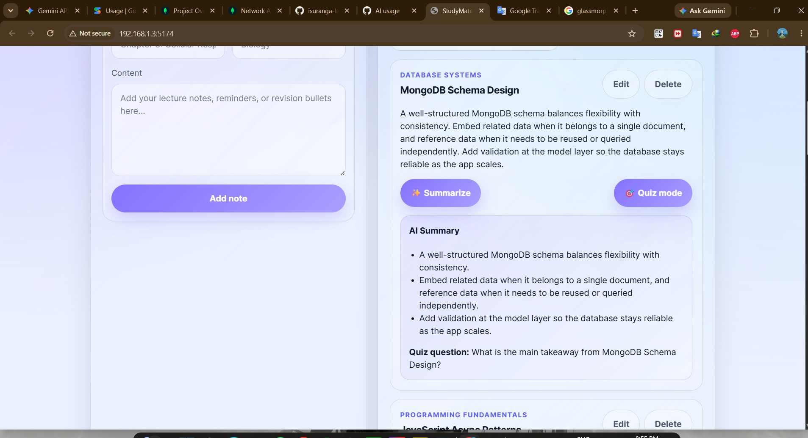
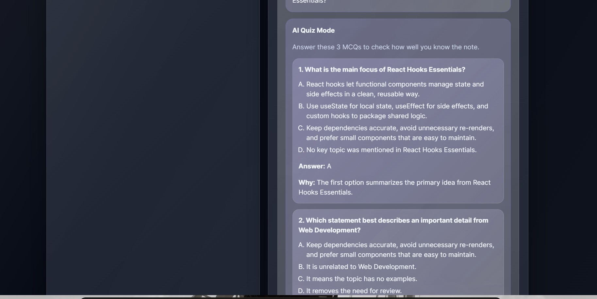

# 📚 StudyMate

> A polished full-stack study workspace for capturing notes, generating AI summaries, running quiz sessions, and managing everything through a Claude-connected MCP workflow.

---

## ✨ Features

- 📝 **Create, edit & delete notes** — store notes with title, subject, and full content in MongoDB
- 🔍 **Instant search** — filter notes by title or subject in real time
- 🤖 **AI Summaries** — generate 3-bullet-point summaries powered by Claude
- 🧠 **AI Quiz Mode** — auto-generate 3 multiple-choice questions per note
- 🌙 **Dark / Light mode** — persisted across sessions
- 🔗 **MCP integration** — list and create notes directly from Claude Desktop

---

## 🛠 Tech Stack

| Layer                 | Technology                                          |
| --------------------- | --------------------------------------------------- |
| **Landing page**      | HTML, CSS, Vanilla JavaScript                       |
| **Frontend (client)** | React 18, Vite                                      |
| **Backend (server)**  | Node.js, Express, MongoDB, Mongoose                 |
| **AI features**       | Anthropic Claude API (`claude-3-5-sonnet-20241022`) |
| **MCP server**        | Node.js stdio — Model Context Protocol SDK          |

---

## 📂 Repository Structure

```
Assignment DSJ/
├── landing/          # Static marketing/landing page
├── client/           # React + Vite frontend app
├── server/           # Express REST API + MongoDB + AI routes
├── mcp-server/       # MCP stdio server (Claude Desktop integration)
└── docs/
    └── screenshots/  # App screenshots for README
```

---

## 🚀 Setup

> **Prerequisites:** Node.js ≥ 18, MongoDB running locally (or Atlas URI), Anthropic API key (optional — AI features are gracefully skipped without it)

---

### 1 · Server

```bash
cd server
npm install
cp .env.example .env   # then fill in your values
npm run dev
```

**`server/.env.example` — variable reference:**

| Variable            | Default                               | Description                                                              |
| ------------------- | ------------------------------------- | ------------------------------------------------------------------------ |
| `PORT`              | `5000`                                | Port the Express API listens on                                          |
| `MONGO_URI`         | `mongodb://127.0.0.1:27017/studymate` | MongoDB connection string (local or Atlas)                               |
| `ANTHROPIC_API_KEY` | _(empty)_                             | Your Anthropic key — **optional**, AI routes skip gracefully when absent |
| `ANTHROPIC_MODEL`   | `claude-3-5-sonnet-20241022`          | Claude model used for summarization & quiz generation                    |

The API will be available at `http://localhost:5000`.

---

### 2 · Client

```bash
cd client
npm install
cp .env.example .env.local   # optional — only needed if your API is not on port 5000
npm run dev
```

**`client/.env.example` — variable reference:**

| Variable       | Default                 | Description                           |
| -------------- | ----------------------- | ------------------------------------- |
| `VITE_API_URL` | `http://localhost:5000` | Base URL of the StudyMate Express API |

The React app will be available at `http://localhost:5173`.

---

### 3 · MCP Server

```bash
cd mcp-server
npm install
cp .env.example .env   # optional — only needed if your server runs on a different port
```

**`mcp-server/.env.example` — variable reference:**

| Variable            | Default                 | Description                                      |
| ------------------- | ----------------------- | ------------------------------------------------ |
| `STUDYMATE_API_URL` | `http://localhost:5000` | Base URL of the Express API the MCP server calls |

**Available MCP tools:**

| Tool          | Description                                                             |
| ------------- | ----------------------------------------------------------------------- |
| `list_notes`  | Returns all notes as JSON                                               |
| `create_note` | Creates a new note — requires `title` and `content`, optional `subject` |

**Claude Desktop config** — add to your `claude_desktop_config.json`:

```json
{
  "mcpServers": {
    "studymate": {
      "command": "node",
      "args": ["C:/path/to/Assignment DSJ/mcp-server/index.js"]
    }
  }
}
```

Once connected, ask Claude things like:

- _"What notes do I have?"_
- _"Add a note titled React Hooks with subject Frontend"_

---

## 🖥 Screenshots

### App UI — Main Interface


---

### App UI — Notes View


---

### AI Feature — Summarize



---

### AI Feature — Quiz Mode



---

## 🌐 Running Everything Together

```bash
# Terminal 1 — Start the backend API
cd server && npm run dev

# Terminal 2 — Start the React client
cd client && npm run dev

# Terminal 3 — (Optional) Start the MCP server standalone
cd mcp-server && node index.js
```

Then open **http://localhost:5173** in your browser.

---

## 📌 Commit Guidelines

Make **4–5 meaningful commits** as you complete each part — not one giant commit at the end. For example:

```
feat: add Express API with MongoDB note routes
feat: add React client with search and CRUD
feat: integrate Claude AI summarization route
feat: add MCP server with list_notes and create_note tools
docs: add screenshots and finalize README
```

---

_Built for the DSJ Academy Assignment — Full-Stack Notes App with AI + MCP Integration_
